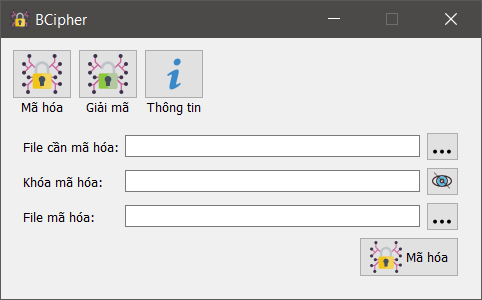

# BCipher
Mã hóa dữ liệu có dung lượng vừa và nhỏ bằng thuật toán AES

## Mô tả
Công cụ mã hóa các file dữ liệu vừa và nhỏ. Sử dụng thuật toán AES với độ dài khóa 256 và phương thức kiểu CFB.

## Biên dịch
Cài đặt Qt, extension cho Visual Studio là Qt Visual Studio Tools.
